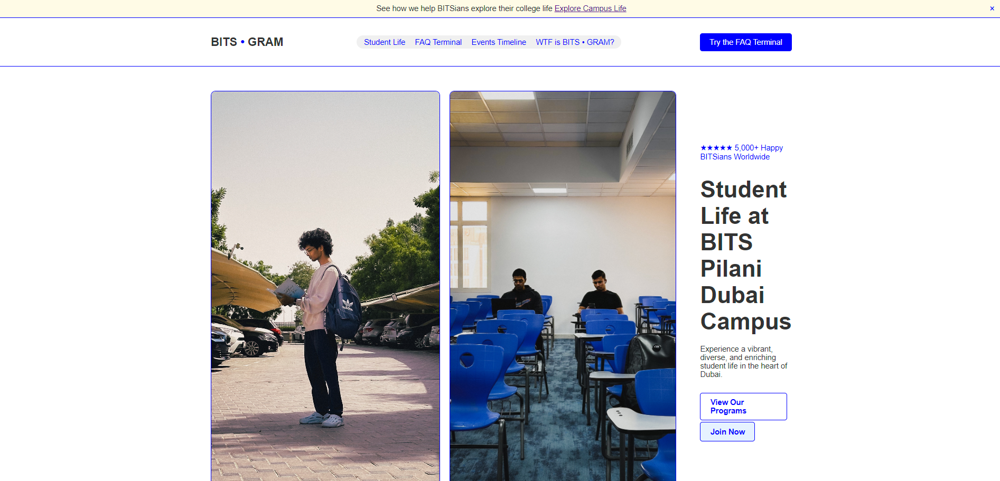
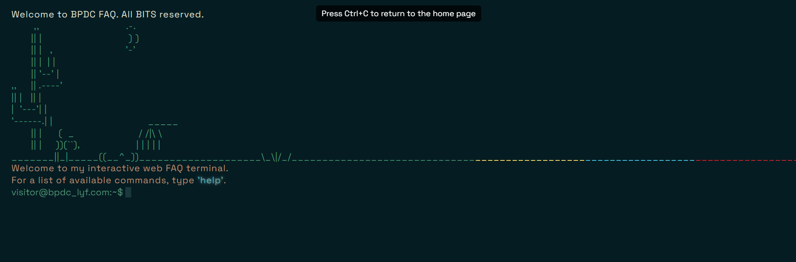

>- Theme: Student Life
>- Team CINS
>- Team members: Mohammed Husamuddin, Yashwanth Karuparthi

# [BITS • GRAM: A Portfolio Website for BITS Pilani Dubai Campus](https://bitsgram.netlify.app/)
Explore the dynamic culture, events, and stories that make student life at BITS Pilani Dubai unique. <br>
From vibrant festivals to favourite hangout spots, dive into the heart of campus experiences!



## Also Featuring: The Terminal FAQ
> Embrace the terminal lyf!
- Discover answers to some of the intriguing questions students often face.



## Setup Guidelines
### Fork and Clone
- Fork the repository using the `Fork` button and clone it using the following command:
```
git clone git:github@<YOUR_USERNAME>/MTC-Mediathon.git
cd MTC-Mediathon
```
